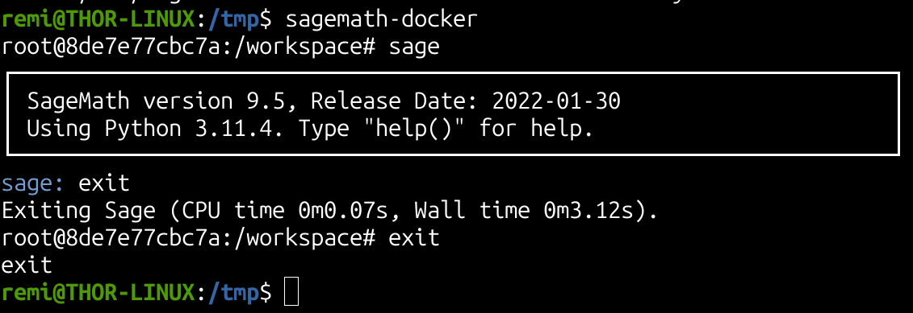

<p align="center">
  A sagemath docker for crypto challenges in CTFs
  <br>
  
  <a href="https://twitter.com/intent/follow?screen_name=podalirius_" title="Follow"></a>
  <a href="https://www.youtube.com/c/Podalirius_?sub_confirmation=1" title="Subscribe"></a>
  <br>
</p>

## Features

 - [x] [SageMath](https://www.sagemath.org/) installation in a standalone container
 - [x] Mount your current working directory on the host in `/workspace/` in the container
 
> ![NOTE] This container was created following the removal of `sagemath` in the official Ubuntu repositories, following an incompatibility (https://askubuntu.com/questions/1516582/how-to-install-sagemath-in-ubuntu-in-24-04)

## Example

When you are in need of sagemath in a folder, simply type `sagemath-docker`, and you will get into the container:



## Installation

You need to install [docker](https://docs.docker.com/engine/install/ubuntu/) to use this tool. Once this is done, you can build the container and install the command by typing `make install` in this repository.

If you are using:
 - **Debian**: https://docs.docker.com/engine/install/debian/
 - **Ubuntu**, **XUbuntu**, **LUbuntu**: https://docs.docker.com/engine/install/ubuntu/
 - **Kali**: It is based on debian so you just need to follow the Debian tutorial https://docs.docker.com/engine/install/debian/.

   The only different step in the tutorial for Kali is the last command of the first step _Add the repository to Apt sources_. Don't use:
    ```sh
    # Add the repository to Apt sources:
    echo \
      "deb [arch="$(dpkg --print-architecture)" signed-by=/etc/apt/keyrings/docker.gpg] https://download.docker.com/linux/debian \
      "$(. /etc/os-release && echo "$VERSION_CODENAME")" stable" | \
      sudo tee /etc/apt/sources.list.d/docker.list > /dev/null
    ```
    
    But use instead:
    
    ```sh
    echo "deb [arch=amd64 signed-by=/etc/apt/keyrings/docker.gpg] https://download.docker.com/linux/debian buster stable" > /etc/apt/sources.list.d/docker.list
    ```

## Contributing

Pull requests are welcome. Feel free to open an issue if you want to add other features.
